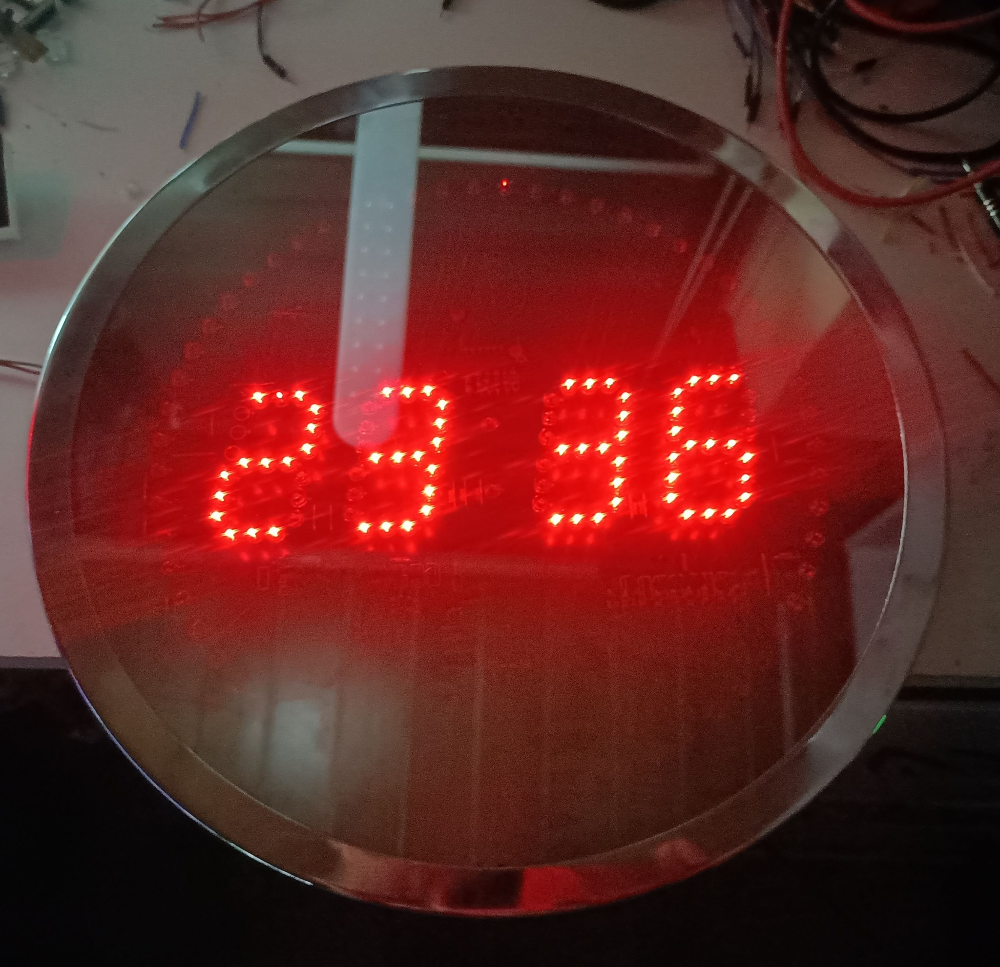

# Nerd-Clock

WLAN- und MQTT-Steuerung einer LED-Uhr mit vier aus einzelnen LEDs aufgebauten Ziffern und einem 60-LED-Ring. Der ursprüngliche Holtek HT48R066 wird durch einen Arduino UNO R4 WiFi bzw. den getesteten Freenove-Nachbau ersetzt. Der vorhandene 74HC595 und die Transistorstufen bleiben auf der Platine.



[Entwicklung in Bildern: vom ursprünglichen Aufbau bis zur Uhr im Gehäuse](docs/DEVELOPMENT.md)

## Funktionen

- Uhrzeit ohne führende Stunden-Null (`0:00`, `9:05`, `10:05`); Timer ebenso ohne führende Minuten-Null.
- Uhrzeit mit NTP und Europe/Berlin einschließlich Sommer-/Winterzeit.
- WLAN-Einrichtung mit **HiTECH R4 Wifi Manager**, ohne Zugangsdaten im Code.
- Weboberfläche für Helligkeit, Ring-Stil, Nachtmodus, MQTT und NTP.
- Sekundenring als Punkt, auffüllender Kreis, reduzierender Kreis oder invertierter Punkt.
- Timer `MM:SS` bis **99:59**, Pause/Fortsetzen und optionaler Gesamtfortschrittsring.
- Letzte Timer-Minute: gesamter Ring abwechselnd eine Sekunde an und aus. Bei Pause bleibt auch dieses Muster stehen.
- Timerende: Uhrzeit auf den Ziffern und **10 Sekunden Doppelblitze** am Ring. Je Zyklus 100 ms an, 100 ms aus, 100 ms an, 700 ms aus. Quittierbar.
- Numerische Anzeige mit bis zu vier Ziffern, führenden Nullen und optionaler Anzeigedauer.
- **Datum ausschließlich per MQTT-Flag**: `TT:MM`, Doppelpunkt dauerhaft an, Ring aus. Dauer ebenfalls per MQTT.
- MQTT-Status, Verfügbarkeit und Timer-Ende-Ereignis; automatische Home-Assistant-Erkennung mit 22 Entitäten.
- OTA-Firmwareupdate über die Weboberfläche mit Download, Dateiprüfung und separater Installation.
- Interne Matrix ausschließlich für Systeminfos: `AP` und IP-Laufschrift für 60 Sekunden.

## Installation

1. Repository herunterladen oder klonen.
2. In der Arduino IDE das Boardpaket **Arduino UNO R4 Boards** installieren; Board **Arduino UNO R4 WiFi** auswählen.
3. Bibliotheken installieren:

   | Bibliothek | Getestete Version |
   |---|---|
   | Arduino UNO R4 Boards | 1.6.0 |
   | HiTECH R4 Wifi Manager | 2026.6.20 |
   | PubSubClient | 2.8 |

   `WiFiS3`, `FspTimer`, `Arduino_LED_Matrix`, `OTAUpdate` und `EEPROM` gehören zum Boardpaket. HiTECH ist auch als [ZIP auf GitHub](https://github.com/HiTECH-Corporation/R4-WifiManager) verfügbar; in der IDE über **Sketch → Bibliothek einbinden → .ZIP-Bibliothek hinzufügen** installieren.

4. **`firmware/Nerd_Clock/Nerd_Clock.ino`** öffnen. Alle `.cpp`-/`.h`-Dateien müssen im selben Sketchordner bleiben.
5. Sketch hochladen. Die Pinbelegung entspricht der vorherigen Einzeldatei-Version, siehe [Verdrahtung](docs/HARDWARE.md).
6. Beim ersten Start mit **`Nerd-Clock-Setup`**, Passwort **`NerdClock2026`**, verbinden und **http://192.168.4.1** öffnen. Über **WLAN einrichten / wechseln** zur HiTECH-Seite gehen und Zugangsdaten eingeben.
7. Nach der Verbindung läuft die IP auf der internen Matrix. Unter **http://IP-DER-UHR/** ist die Weboberfläche erreichbar; WLAN-Verwaltung unter **http://IP-DER-UHR:8080/**.

Die Weboberfläche und MQTT sind für das lokale Heimnetz ausgelegt: HTTP und MQTT/TCP ohne TLS; die Weboberfläche hat keine eigene Benutzeranmeldung. Nicht direkt ins Internet freigeben.

## Firmwareupdate per WLAN

Diese Version einmal per USB installieren. Danach in der Weboberfläche eine lokal bereitgestellte `.ota`-Datei herunterladen, prüfen und installieren. WLAN-Firmware ab 0.5.0 erforderlich. Der Python-Helfer erzeugt und liefert die OTA-Datei aus dem exportierten Sketch. Die vollständigen Schritte stehen in [OTA.md](docs/OTA.md).

## Datum über MQTT

Standard-Basis-Topic: `nerd-clock`, in der Weboberfläche änderbar.

```sh
# Dauer zuerst setzen, dann Datum einblenden:
mosquitto_pub -h BROKER -t nerd-clock/set/date_duration -m 5
mosquitto_pub -h BROKER -t nerd-clock/set/date -m 1

# Sofort ausblenden:
mosquitto_pub -h BROKER -t nerd-clock/set/date -m 0
```

`date_duration` ist 1–3600 Sekunden und wird gespeichert. Eine Änderung gilt für die nächste Einblendung. `1`, `ON` oder `true` startet bzw. verlängert die Einblendung; `0`, `OFF` oder `false` blendet aus. Nach Ablauf erlischt das interne Flag automatisch. Es gibt **keine automatische Datumsanzeige, keinen Datum-Button im Web und kein Datum auf der internen Matrix**.

Das Datum braucht eine erfolgreiche Zeitsynchronisierung und wird nur im Uhrmodus ohne laufenden Alarm angenommen. Anforderungen während Timer, Text oder Alarm werden abgewiesen, nicht vorgemerkt. Neue Timer-/Text-Befehle sowie „Zur Uhr“ beenden eine bestehende Datumsanzeige. In Home Assistant lässt sich das Datum über den MQTT-Schalter bedienen.

## Timer, Text und Nachtmodus

- Ein Timerwert ist immer in **Sekunden**, etwa `300` für `5:00`. `0` bricht ab. Pause bewahrt auch Sekundenbruchteile; NTP-Korrekturen beeinflussen den Countdown nicht.
- Neue Timer- oder Text-Befehle ersetzen den aktuellen Modus und quittieren einen aktiven Abschlussalarm. `clock` kehrt jederzeit zur Uhr zurück; `ack` beendet nur die Doppelblitze.
- Der optionale Timer-Fortschrittsring startet vollständig gefüllt und schrumpft proportional zur gesamten Restzeit. In der letzten Minute hat das Blinkmuster Vorrang.
- Text wird rechtsbündig angezeigt. `0032` bleibt `0032`; `7` belegt nur Z4. Leerer Text kehrt zur Uhr zurück. `text_duration=0` bedeutet unbegrenzt, sonst 1–3600 Sekunden. Änderungen gelten für den nächsten Textbefehl.
- Nachtmodus standardmäßig **deaktiviert**; Zeitfenster 22:00–07:00, Helligkeit 10 %. Das Zeitfenster gilt in Europe/Berlin, von Start einschließlich bis Ende ausschließlich. Gleiche Start-/Endzeit bedeutet ganztägig. Ohne NTP-Synchronisierung bleibt die normale Helligkeit aktiv.
- „Ring nachts aus“ betrifft den Sekundenring im Uhrmodus. Timer und Abschlussalarm bleiben sichtbar. Der Nacht-Helligkeitswert gilt auch für Timer/Text/Alarm; bei 0 % ist die externe Anzeige vollständig aus. Die interne Statusmatrix wird nicht gedimmt.
- 100 % entspricht der bisherigen nominellen LED-Einschaltdauer, keine zusätzliche Maximalhelligkeit.

## MQTT und Home Assistant

Alle Befehle unter `<Basis>/set/...` **ohne Retain** senden. Die Topics und Beispiele sind vollständig in [MQTT.md](docs/MQTT.md) beschrieben. Befehle erwarten einfache Zeichenketten, keine JSON-Objekte.

Bei aktiviertem MQTT und Discovery erscheinen die Entitäten automatisch am selben Broker wie Home Assistant. Discovery nutzt den Standardpräfix `homeassistant`, MAC-basierte IDs und das Standard-Birth-Topic `homeassistant/status`. Bei Verbindung, nach `online`, nach dem Speichern und alle 15 Minuten werden Konfigurationen erneut veröffentlicht. Die Weboberfläche zeigt den Sendezähler und bietet **HA-Discovery erneut senden**. Beim Ändern von Broker/Basis-Topic werden erreichbare alte Discovery-Einträge gelöscht und neue erzeugt. Die Erkennung kann im Web deaktiviert werden.

Für vorhandene HA-Entitäten bleiben die internen MAC-basierten Discovery-IDs mit `ledclock-` erhalten. Geräteanzeige, MQTT-Client-ID und Projektname heißen Nerd-Clock. Das vermeidet doppelte Geräte und erhält bestehende Automationen. Gespeicherte Basis-Topics werden nicht überschrieben; `nerd-clock` ist der Standard bei frischer Einrichtung.

Wenn HA nichts erkennt: In der Weboberfläche muss MQTT **verbunden** und Discovery **gesendet: 22/22** anzeigen. HA muss denselben Broker nutzen und Discovery mit Präfix `homeassistant` aktiviert haben. In HA unter MQTT auf `homeassistant/#` lauschen und **HA-Discovery erneut senden** klicken. Die Konfigurationen müssen dort als JSON ankommen. `22/22` bestätigt nur erfolgreiche lokale MQTT-Schreibaufrufe; Broker-Berechtigungen und Annahme durch HA lassen sich daraus nicht ableiten. Bei fehlenden Nachrichten Broker-ACLs prüfen; bei vorhandenen Nachrichten die HA-Protokolle auf abgewiesene Konfigurationen prüfen. Das `online`-Signal auf `<Basis>/availability` wird retained bei Verbindung, nach Discovery, bei HA-Start und alle 60 Sekunden gesendet; fehlgeschlagene lokale Schreibaufrufe werden nach 2 Sekunden wiederholt. Die Webdiagnose zeigt auch den Online-Sendestatus. Technischer Status unter `/api/mqtt`, Verbindungsfehler auch seriell bei 115200 Baud.

Der Timer sendet nach Ablauf ein nicht-retainiertes Ereignis auf `<Basis>/event`; Home Assistant bekommt dazu eine Event-Entität. Fällt MQTT aus, wird das zuletzt noch nicht gesendete Timer-Ende-Ereignis bei Wiederverbindung nachgereicht, solange die Uhr nicht neu startet. Mehrere zwischenzeitliche Timerenden ersetzen dieses eine vorgemerkte Ereignis. Es gibt keine dauerhafte Ereigniswarteschlange; Zustellung erfolgt mit QoS 0.

## Einstellungen und Upgrade

WLAN-Profile gehören der HiTECH-Bibliothek. App-Einstellungen sind mit Versionskennung und CRC32 separat ab EEPROM-Adresse 1024 gespeichert. Die bisherigen Einstellungen der Einzeldatei-Version werden automatisch übernommen; neue Optionen erhalten ihre Standardwerte. MQTT-Konfigurationsänderungen werden nach zwei Sekunden ohne weitere Änderung gespeichert, Web-Einstellungen sofort. Timer, Text, Alarm und Datumsflag sind Laufzeitzustände und werden nicht über Neustarts fortgesetzt.

Serieller Monitor: **115200 Baud**. `resetwifi` + Enter löscht ausschließlich die WLAN-Profile und startet die Einrichtung erneut. App-Einstellungen bleiben erhalten.

## Projektstruktur

| Datei | Aufgabe |
|---|---|
| `App.cpp`, `App.h`, `State.cpp` | Hauptablauf, gemeinsame Schnittstellen und Zustand |
| `Display.cpp` | Multiplexing, Ziffern, Ring und zeitgenaue Alarmblitze |
| `ClockTime.cpp` | WLAN-Service, NTP, Berliner Zeit und Nachtfenster |
| `ClockConfig.cpp` | Einstellungen, CRC und Migration |
| `Commands.cpp` | Timer, Pause, Text, Datum und Befehlsprüfung |
| `Mqtt.cpp` | MQTT, Discovery, Zustände und Ereignisse |
| `Ota.cpp` | R4-OTA, Fortschritt, Prüfung, Installation |
| `MatrixStatus.cpp` | AP/IP-Systeminfos |
| `Web.cpp`, `WebUi.h` | HTTP-API und Weboberfläche |

## Entwickeln und prüfen

```sh
# Host-Tests: g++, Python 3 und Node.js erforderlich
./tests/run.sh

# Arduino CLI; HiTECH zusätzlich über Bibliotheksverwalter oder ZIP installieren:
arduino-cli core update-index
arduino-cli core install arduino:renesas_uno@1.6.0
arduino-cli lib install 'PubSubClient@2.8'
arduino-cli compile --fqbn arduino:renesas_uno:unor4wifi firmware/Nerd_Clock
```

GitHub Actions führt Host-Tests und einen echten R4-Build aus. Host-Stubs prüfen die Anwendungslogik, nicht das reale Timing von GPIO, WLAN oder EEPROM. Der R4-Build wurde lokal mit den oben genannten Versionen erfolgreich ausgeführt. Die neuen Funktionen benötigen zusätzlich einen Test auf der Uhr.

Die HiTECH-Bibliothek enthält Wartezeiten bei Verbindungsaufbau und Netzwerkzugriffen. Die LED-Ansteuerung läuft unabhängig im Timer-Interrupt; die Alarmblitze werden dort erzeugt, damit ein blockierender Netzwerkaufruf sie nicht anhält.

## Lizenz

Eigener Projektcode: [MIT](LICENSE). Die separat installierten Arduino-/HiTECH-/PubSubClient-Bibliotheken behalten ihre jeweiligen Lizenzen.
