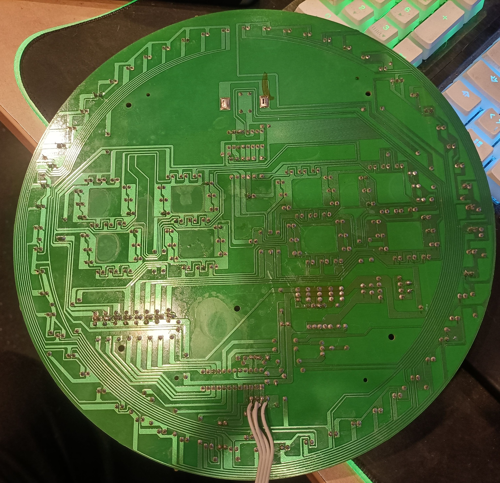
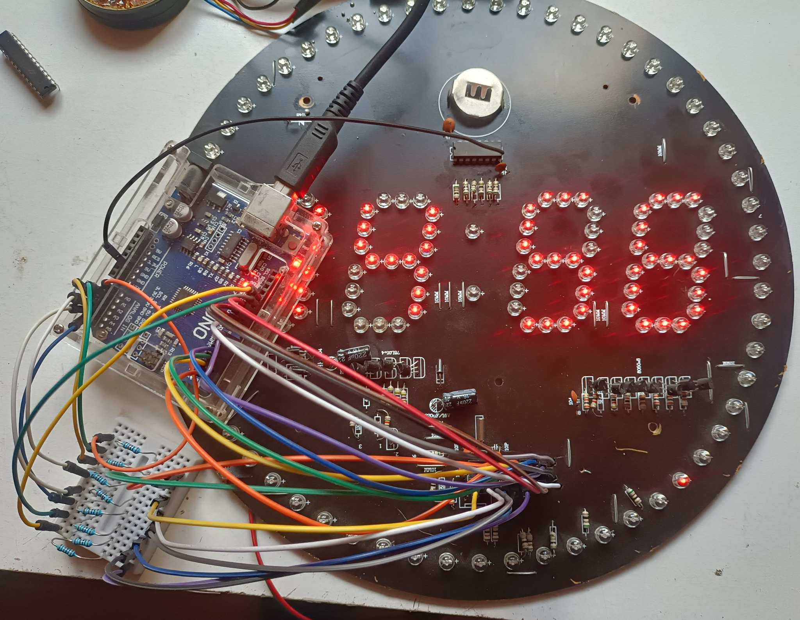
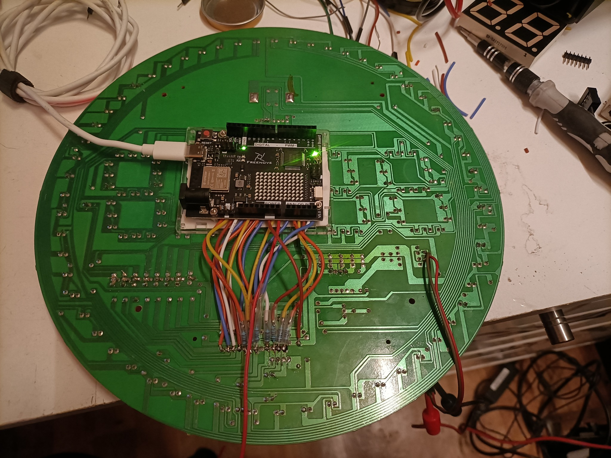
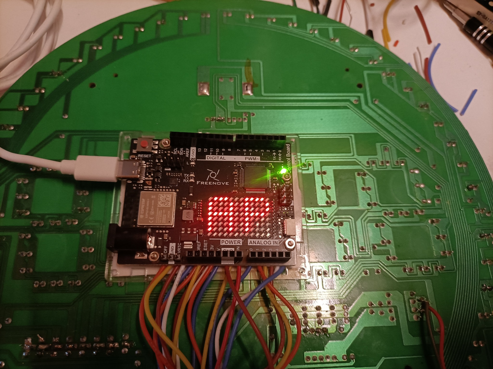
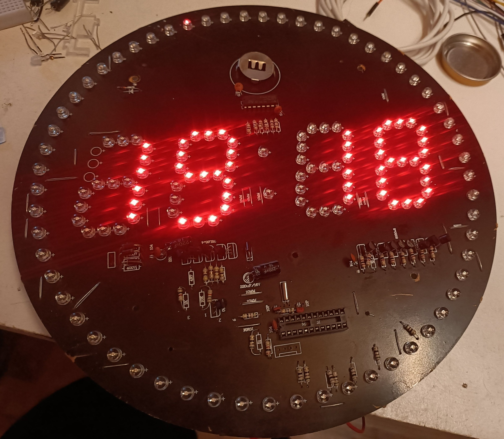

# Entwicklung in Bildern

Die Fotos dokumentieren die chronologische Entwicklung von Nerd-Clock. Die Nummern 1 bis 6 entsprechen der Reihenfolge des Umbaus.

## 1. Ursprüngliche Platine: Rückseite mit Leiterbahnen.

## 2. Erster Aufbau mit externer Verdrahtung und leuchtender Anzeige.

## 3. UNO R4 WiFi auf der Rückseite der Platine montiert.

## 4. Systemanzeige auf der integrierten LED-Matrix des UNO R4 WiFi.

## 5. Uhrzeitanzeige auf der offenen Platine.

## 6. Uhrzeitanzeige im Gehäuse.

[Zurück zur Projektübersicht](../README.md)
